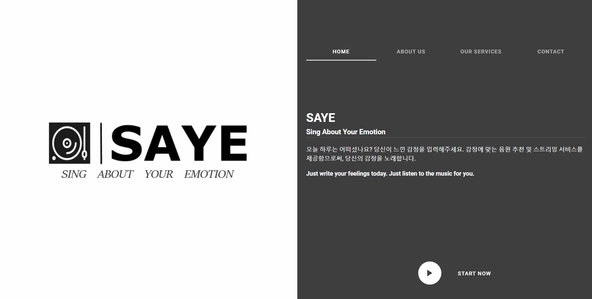
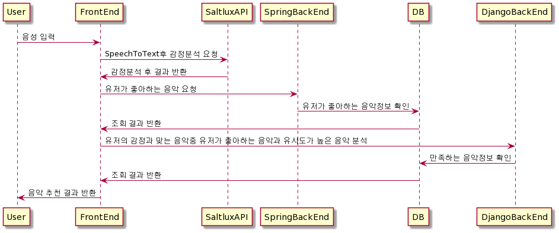
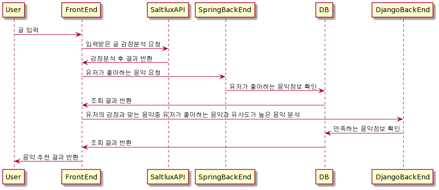

> Team 6
> 
> BigData PJT

# Sing About Your Emotion (SAYE) 🎶🎶🎶

| 😘 SAYE :: Sing About Your Emotion, 당신의 감정을 노래하다. 자세한 기획 개요는 [여기서](./docs/assets/README.md) 보실 수 있습니다.


<div align="center">
  <br>
  <a href="https://j4d106.p.ssafy.io/"></a>
</div>
<div style="display:flex; justify-content: center;">
  <p align="center">
    <a href="./">한국어</a> •
    <a href="./docs/translate/README.md">English</a> 
  </p>
</div>

---


<div style="display:flex; justify-content: center;">
<p align="center">

  <a href="https://vuejs.org/">
    
  </a>
  <a href="https://vuetifyjs.com/en/">
      
  </a>
    <a href="https://spring.io/projects/spring-boot">
      
  </a>
    <a href="https://www.mysql.com/">
      
  </a>
    <a href="https://www.docker.com/get-started">
      
  </a>
    <a href="https://www.jenkins.io/">
      
  </a>
  <!--<a href="https://www.paypal.me/AmitMerchant">-->
  <a href="">
    
  </a>
</p>
</div>

<div style="display:flex; justify-content: center;">
<p align="center">
  <a href="https://www.spotify.com/kr-ko/">
    
  </a>
    <a href="https://www.youtube.com/">
    
  </a>
</p>
</div>

<h3 align="center">오늘 하루에 대한 당신의 감정(고민,생각)을 분석하여, 당신을 위한 노래 추천 및 스트리밍 서비스 </h3>

<p align="center">
  <a href="https://j4d106.p.ssafy.io/">사이트 방문</a> •
  <a href="./docs/demo/README.md">데모(demo)</a> 
</p>



## 🚩 Table of Contents


- [Sing About Your Emotion (SAYE) 🎶🎶🎶](#sing-about-your-emotion-saye-)
  - [🚩 Table of Contents](#-table-of-contents)
  - [🤖 What's SAYE?](#-whats-saye)
  - [🎨 Features](#-features)
  - [🐾 Architecture](#-architecture)
    - [Entity Relationship Diagram](#entity-relationship-diagram)
    - [Sequence Diagrams](#sequence-diagrams)
  - [🌏 Browser Support](#-browser-support)
  - [📦 Packages (M)](#-packages-m)
    - [Frontend](#frontend)
    - [Backend](#backend)
  - [📚 준비하기](#-준비하기)
  - [🏁 실행하기](#-실행하기)
  - [🖥 배포하기](#-배포하기)
  - [💬 Documents](#-documents)
  - [👥 Contributer](#-contributer)
  - [🚀 References](#-references)
  - [📜 License](#-license)

---

## 🤖 What's SAYE?

노래 그리고 감정을 키포인트로 프로젝트명을 생각하던 중, 우리 서비스는 <span style="font-weight:bold;background-color: rebeccapurple">사용자의 감정을 입력받아 해당 감정에 맞는 노래를 추천해주고 들려주는 서비스</span>입니다. 그래서 "사용자의 감정에 대한 노래를 불러주는 서비스"라 생각을 하고 접근을 하다가 최종적으로 "Sing abougt your emotion" 약자를 줄여, __SAYE__ 라는 프로젝트명이 탄생하게 되었습니다.


## 🎨 Features

* [**음원 스트리밍**] 
    * 스포티파이의 국내 정책 상 1분만 듣기 가능함
    * 유튜브 영상을 맵핑시킴으로 최대한 전체 음원을 들을 수 있도록 구현(크롤링 실패 시 유튜브로 이동)
    * 오른쪽 Sidebar에 컨트롤러 구현

* [**북마크/플레이리스트**]
  * 북마크 기능 제공
  * 플레이리스트 여러개 생성/삭제 가능
  * 마이페이지에서 drag&drop으로 북마크에 있던 음원을 플레이리스트에 추가 가능

* [**감정에 따른 음원 추천**] 
  * 직접 텍스트 입력 및 STT 기능 구현
  * 입력되는 글을 기반으로 감정 분석
  * 해당 감정과 유저의 플레이리스트를 기반으로 음원 추천

* [**익명 게시판**]
  * 댓글 기능
  * 익명 게시판에 작성된 글을 기반으로 감정 분석하여 음원 추천


## 🐾 Architecture

### Entity Relationship Diagram


### Sequence Diagrams

- 회원가입 


- 로그인


- STT 검색


- 감정분석 검색


- 일반 검색


- 게시판


---

## 🌏 Browser Support

|  Chrome |  Internet Explorer |  Edge |  Safari |  Firefox |
| :---------: | :---------: | :---------: | :---------: | :---------: |
| Yes | 10+ | Yes | Yes | Yes |


## 📦 Packages (M)

###  Frontend

| Name | Description |
| --- | --- |
| [`@gsap`](https://greensock.com/docs/v2/NPMUsage) | Professional-grade animation for the modern web |
| [`@lodash`](https://lodash.com/) | The Lodash library exported as Node.js modules. |
| [`@get-youtube-id`](https://github.com/jmorrell/get-youtube-id) | Parse a youtube url returning the video ID |
| [`@vue-youtube`](https://github.com/anteriovieira/vue-youtube#readme) | Wrapper of [YouTube IFrame](https://developers.google.com/youtube/iframe_api_reference?hl=ko) Player API (YIPA) |
| [`@vue-lottie`](https://github.com/chenqingspring/vue-lottie#readme) | Lottie Animation View for Vue |
| [`@lottie-web`](https://github.com/airbnb/lottie-web#readme) | Lottie for Web, Android, iOS, React Native, and Windows |
| [`@sweetalert2`](https://sweetalert2.github.io/) | A beautiful, responsive, customizable, accessible (WAI-ARIA) replacement for JavaScript's popup boxes. Zero dependencies. |
| [`@vue-audio-recorder`](https://github.com/grishkovelli/vue-audio-recorder#readme) | Audio recorder for Vue.js. It allows to create, play, download and store records on a server |
| [`@vue-cookies`](https://github.com/cmp-cc/vue-cookies#readme) | A simple Vue.js plugin for handling browser cookies |
| [`@vuedraggable`](https://github.com/SortableJS/Vue.Draggable#readme) | allowing drag-and-drop and synchronization with view model array. |
| ---Basic--- |  |
| [`@axios`](https://github.com/axios/axios) | Promise based HTTP client for the browser and node.js |
| [`@vuetify`](https://vuetifyjs.com/en/) | Vue Material Component Framework |
| [`@vue-router`](https://github.com/vuejs/vue-router#readme) | vue-router 3.0 which works only with Vue 2.0 |
| [`@vuex`](https://github.com/vuejs/vuex#readme) | Vuex is a state management pattern + library for Vue.js applications |
| [`@vuex-persistedstate`](https://github.com/) | Promise based HTTP client for the browser and node.js |


### Backend

| Name | Description |
| --- | --- |
| [`$mysql`]() | MySQL connector |
| [`$mybatis`]() | XML 서술자나 애너테이션을 사용하여 저장 프로시저나 SQL 문으로 객체들을 연결 |
| [`$lombok`]() | getter, setter, toString 등의 메서드 작성 코드를 줄여주는 코드 다이어트 라이브러리 |
| [`$jjwt`]() | JWT 토큰 생성 및 JWT 토큰 파싱, 검증을 해주는 라이브러리  |
| [`$json`]() | JavaScript Object Notation; 경량(Lightweight)의 DATA-교환 형식 |
| [`$jackson`]() | JSON Convertor(컨트롤러에서 전달한 DTO데이터를 JSON으로 변경하기 위해 사용 |
| [`$jython`]() | For use python in spring |
| [`$swagger`]() | REST 웹 서비스를 설계, 빌드, 문서화, 소비하는 일을 도와주는 대형 도구 생태계의 지원을 받는 오픈 소스 소프트웨어 프레임워크 |
| [`$spotify`]() | Spotify Web api |
| [`$youtube`]() | Google api services for youtube |

</br>

## 📚 준비하기

> DB 생성하고 설정 파일 application.properties(백엔드), .env(프론트엔드) 파일 생성 및 추가하시면 됩니다

1. Git clone 받기

```
git clone https://lab.ssafy.com/s04-bigdata-sub3/s04p23d106.git
```

2. 데이터베이스 준비

- 'saye' 테이터베이스 생성

```
CREATE SCHEMA `saye`;
```

-  필요한 테이블 생성

```
INSERT INTO roles(name) VALUES('ROLE_USER');
INSERT INTO roles(name) VALUES('ROLE_MODERATOR');
INSERT INTO roles(name) VALUES('ROLE_ADMIN');
```

3. [**Backend**] application.properties 설정

- backend\src\main\resources 폴더 아래 생성하시면 됩니다
- mysql 도메인과 아이디/비번 작성

```
server.port=8000
server.servlet.context-path=/saye

# for social login
spring.profiles.include=oauth

## JSP
#spring.mvc.view.prefix=/WEB-INF/views/
#spring.mvc.view.suffix=.jsp

# fileupload 
spring.servlet.multipart.enabled=true
spring.servlet.multipart.max-file-size=20MB
spring.servlet.multipart.max-request-size=30MB
    
# db
spring.datasource.url=jdbc:mysql://{도메인주소}:3306/saye?serverTimezone=UTC&useUniCode=yes&characterEncoding=UTF-8
spring.datasource.driver-class-name=com.mysql.cj.jdbc.Driver
spring.datasource.username={DB 계정 아이디}
spring.datasource.password={DB 계정 비밀번호}
mybatis.type-aliases-package=com.gokchu.saye.repository.dto
mybatis.mapper-locations=mapper/*.xml
mybatis.configuration.map-underscore-to-camel-case=true


```

4. [Frontend] .env 작성

- frontend 폴더 아래 생성하시면 됩니다
- nginx에 명시된 location을 따라갑니다

```
VUE_APP_SERVER_URL={도메인주소}
VUE_APP_SPRING_URL={도메인주소}/saye
VUE_APP_DJANGO_URL={도메인주소}/recommend
```

5. [Frontend] 모듈 다운로드

```
# frontend 폴더로 이동해서 다운
cd frontend/
yarn install
```

6. [Backend] (Option) Spring boot를 build(jar 파일 생성)

```
# backend 폴더로 이동해서
cd backend/
mvn -B -DskipTests -f backend
```

<br />

## 🏁 실행하기

1. 백엔드 실행

- 생성한 jar 파일 실행

```
java -jar [filename].jar
```

- 혹은 war 파일 생성하지 않고 demon으로 로컬에서 실행하고 싶다면 STS와 같은 IDEA에서 Spring boot Run을 실행하거나 아래 명령어를 통해 실행

```
mvn spring-boot:run
```

2. 프론트엔드 실행

```
yarn serve
```

<br />

## 🖥 배포하기

해당 서비스는 AWS EC2를 통해 배포하였고
Docker와 Jenkins를 이용해 CI/CD 구축하였습니다:

1. AWS EC2 인스턴스 생성 (ubuntu)
2. docker 설치
3. 필요한 이미지를 docker hub를 통해 설치
   1. Jenkins
   2. MySQL
4. Jenkins와 Gitlab repository 연동
5. MySQL 컨테이너에 `saye` DB 스키마 생성
6. Nginx 설정 (frontend/nginx 폴더의 homepage.conf)
7. frontend, backend 폴더 안에 dockerfile 작성
8. 프로젝트 root 위치에 Jenkins 파일 작성
   1. Build and Test 과정
   2. Build (frontend, backend)
   3. Run (컨테이너 실행)
9. `docker ps` 를 통해 frontend, backend, django 컨테이너가 실행되는 것을 확인 (Jenkins, MySQL 포함)

<br />


## 💬 Documents

* [SAYE - Notion](https://www.notion.so/oct14jh/SAYE-Sing-About-Your-Emotion-301b283ab8ca4fb7b49647eb99e98a20)


## 👥 Contributer

- [김지현](https://github.com/)
- [김동빈](https://github.com/)
- [김태진](https://github.com/)
- [김호빈](https://github.com/)
- [김연정](https://github.com/)


## 🚀 References

- [Markdownify - README.md](https://github.com/amitmerchant1990/electron-markdownify#related)
- [TOAST UI Editor - README.md](https://github.com/nhn/tui.editor#readme)


## 📜 License

This software is licensed under the [MIT](.docs/LICENSE) © [SSAFY](https://www.ssafy.com/ksp/jsp/swp/swpMain.jsp).