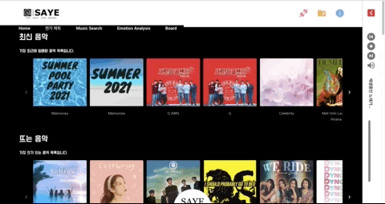
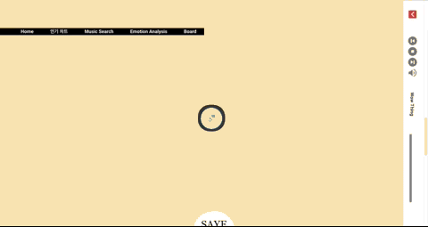
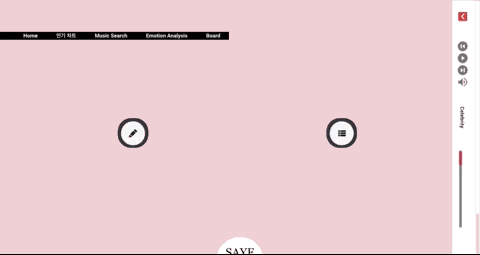
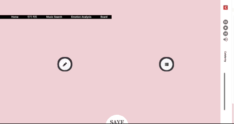

## 🚩 Table of Contents

- [🎼 Intro Page](#-intro-page)
- [🎊 Signin/Signup](#-signinsignup)
    - [- Signin](#--signin)
    - [- Signup](#--signup)
- [🎵 Main Page](#-main-page)
    - [- Aside Player](#--aside-player)
- [🙋‍♀️ My Page](#️-my-page)
- [📚 Music Search](#-music-search)
    - [- Basic Search](#--basic-search)
    - [- Navbar](#--navbar)
    - [- Settings](#--settings)
- [💕 Emotion Analysis](#-emotion-analysis)
- [🐾 Board](#-board)

# 🎼 Intro Page

# 🎊 Signin/Signup

### - Signin

### - Signup

# 🎵 Main Page

### - Aside Player

> Play Music with Youtube iFrame

# 🙋‍♀️ My Page

> Drag&Drop
>
> Add/Delete Playlist

# 📚 Music Search

### - Basic Search

> Music Search with Spotify API

### - Navbar

> Recent Search, Bookmark list, Settings

### - Settings

> Panel type, Bookmark Icon, Results per page

# 💕 Emotion Analysis

> STT(Speach To Text)
> 
> Recommend Music base on Emotion

# 🐾 Board

> Basic Board
> 
> Comment

